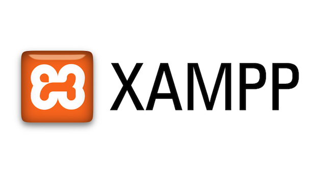
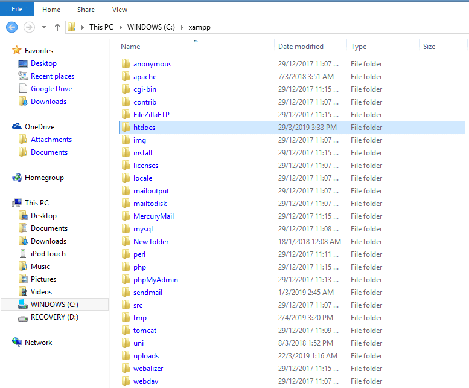
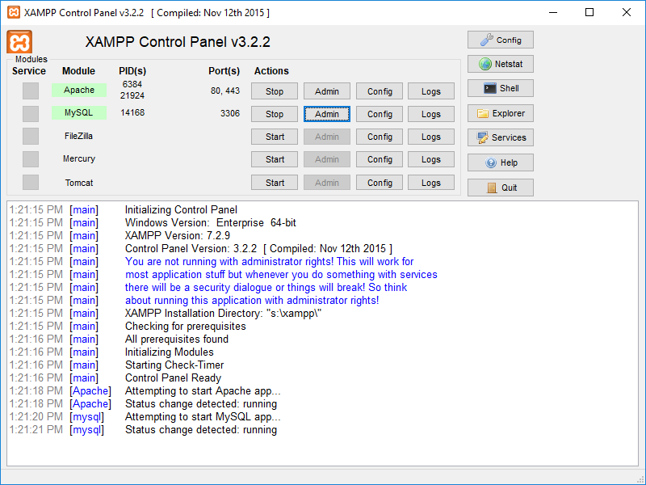
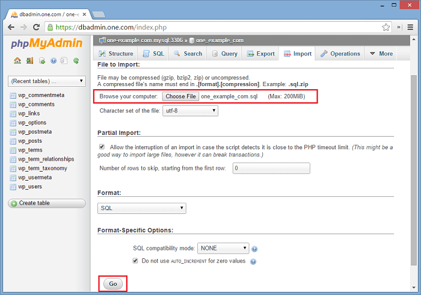

# Flash Entregas

Bem-vindo ao **Flash Entregas!** Este é um programa de entregas.

## Equipe

- Eduardo Duarte Morais
- Eduardo Pereira de Oliveira
- Felipe Pereira Sarmento
- Leandro da Costa Casarregio
- Victor Erick Caxias da Silva
- Rafael Cristaldo Figueiredo   

## Instalação  

1. Verificar se tem instalado em sua máquina o **XAMPP** (se não possuir por favor instale-o).    

2. Faça o **download** do código-fonte do FlashEntregas ou clone este [repositório](https://github.com/dumorais/EngenhariaSoftware).  

3. Procure o diretório em que foi instalado seu **XAMPP** e dentro da pasta **htdocs** coloque os arquivos do Flash Entregas.  

4. Execute seu **XAMPP** ligue o servidor **Apache** e o **MySQL**  

5. Faça importe do nosso banco de dados para seu servidor local.   

> Obs: O DB pode ser importado através do phpMyAdmin ou pelo MySQL Workbench  

6. Por fim, basta apenas abrir um navegador e digitar `"localhost/[nome-do-programa]"` e pressionar enter.   

  Agora o sistema está pronto para ser utilizado.    

